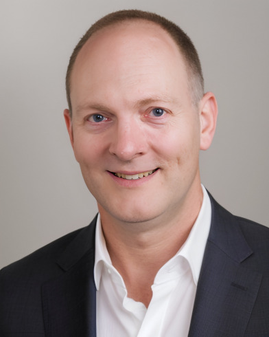

---
styles:
  - message-wrap
---

## Message from Founder and Director

  <figure class="image-wrap">
    
    <figcaption>Christopher T. WhitlowMD, PhD, MHA, FASFNR</figcaption>
  </figure>
  <blockquote class="content">
    
"Welcome to the Radiology Informatics and Image Processing Laboratory (RIIPL), a research laboratory within the Yale School of Medicine Department of Radiology and Biomedical Imaging. Our lab is dedicated to advancing the frontiers of medical imaging through computational modeling, artificial intelligence and deep learning, graph theoretical network methods, and high-throughput analytic pipelines. At the heart of our mission is the translation of these methods into clinical practice, improving patient care and outcomes.

    
Our research spans conditions from early neurodevelopment through later adulthood, with active programs in Alzheimer's disease, traumatic brain injury, neurooncology, preterm birth, adolescent nicotine exposure, Parkinson's disease, diabetes, dyslexia, and the impact of metabolic and vascular factors on neurodegeneration. We integrate multi-site datasets, including large-scale neuroimaging initiatives such as the Alzheimer's Disease Neuroimaging Initiative (ADNI), with computational modeling and AI to deepen biological understanding and guide clinical decision-making.

    
Beyond computational imaging, RIIPL maintains expertise in medical 3D printing for surgical planning and patient education, as well as immersive technologies including virtual reality, extended reality, and spatial computing for diagnostic and therapeutic applications.

    
Our team is a multidisciplinary collective of experts from biomedical engineering, computer science, neuroradiology, and medical physics, along with graduate students, postdoctoral researchers, and undergraduate interns united by a shared commitment to transforming healthcare through imaging science."

  </blockquote>





### Our Research

Our lab specializes in integrating cutting-edge neuroimaging analysis into studies of aging, diet, traumatic brain injury, and more. We pride ourselves on our extensive portfolio of recent publications, highlighting our ongoing contributions to various fields of research.



### Our Team

Our Team is the cornerstone of our lab, comprising a vibrant mix of individuals from various disciplines united by a shared passion for neuroimaging research. Here, you can learn about each member's role, their specific research interests, and the unique contributions they bring to our collective pursuit of knowledge. Our lab thrives on the diversity of thoughts, skills, and interests each person contributes, making us a robust and dynamic force in the field.

